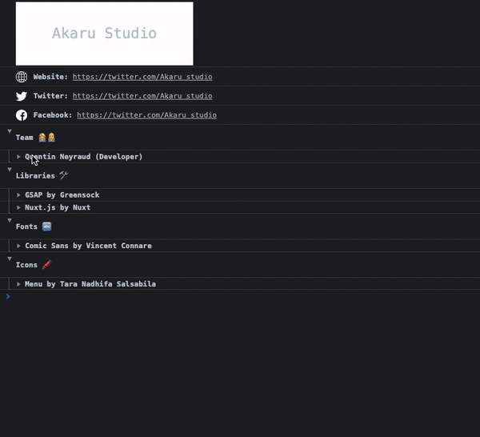

# Nuxt templates

> Collection of Nuxt modules, plugins, components


## Signature

> Script to log informations about the authors, libraries, fonts and icons used in the project.
  
</br>



</br>

### Installation

---

- Copy `modules/signature` in your `modules` directory
- Add `~/modules/signature/index.js` to the `modules` section of `nuxt.config.js`

```js
// nuxt.config.js

{
  modules: [
    ['~/modules/signature/index.js', {
      // module options
    }]
  ]
}

// or

{
  modules: [
    '~/modules/signature/index.js'
  ],

  signature: {
    // module options
  }
}
```


### Usage

---

This script is called on `window.onNuxtReady` event.

> :warning:  This module is disabled in development, set `force` option to `true` to always log the signature.
  
### Options

---

#### Name

type: `String`  
default: `null`  

Agency/Website name

#### website

type: `String`  
default: `null`  

Agency website URL

#### twitter

type: `String`  
default: `null`  

Agency twitter profile URL

#### facebook

type: `String`  
default: `null`  

Agency facebook page URL

#### team

type: `Array`  
default: `[]`  

Array of object with these properties: `name`, `status`, `github`, `twitter`, `website`

#### libraries

type: `Array`  
default: `[]`  

Array of object with these properties: `name`, `author`, `github`, `website`

#### fonts

type: `Array`  
default: `[]`  

Array of object with these properties: `name`, `author`, `website`

#### icons

type: `Array`  
default: `[]`  

Array of object with these properties: `name`, `author`, `website`

#### force

type: `Boolean`  
default: `false`  

Whether to log signature in development


### Example

----

```js
// nuxt.config.js

export default {
  signature: {
    name: 'Akaru Studio',
    website: 'https://twitter.com/Akaru_studio',
    facebook: 'https://twitter.com/Akaru_studio',
    twitter: 'https://twitter.com/Akaru_studio',
    team: [{
      name: 'Quentin Neyraud',
      status: 'Developer',
      github: 'https://www.github.com/quentinneyraud',
      twitter: 'https://www.twitter.com/quentin_neyraud'
    }],
    libraries: [{
      name: 'GSAP',
      author: 'Greensock',
      website: 'https://greensock.com/gsap'
    }, {
      name: 'Nuxt.js',
      author: 'Nuxt',
      website: 'https://nuxtjs.org'
    }],
    fonts: [{
      name: 'Comic Sans',
      author: 'Vincent Connare',
      url: 'http://www.connare.com/'
    }],
    icons: [{
      name: 'Menu',
      author: 'Tara Nadhifa Salsabila',
      url: 'https://thenounproject.com/taraicon/'
    }]
  }
}
```
